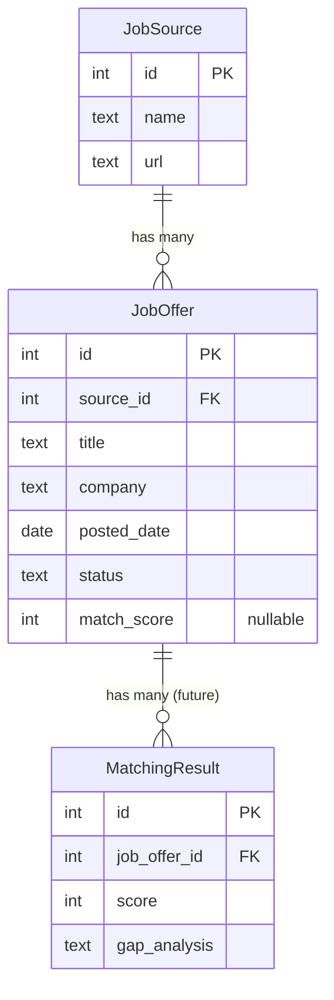

# Data Model: Job Offer Management

**Feature**: 005-job-offer-management
**Date**: 2025-10-14
**Status**: Complete

## Overview

This document defines the data entities, relationships, and validation rules for the Job Offer Management feature. The data model reuses existing database schema (no migrations needed) and extends TypeScript types for renderer/main process communication.

---

## Entities

### JobOffer

**Purpose**: Represents a single job opportunity the user is tracking

**Database Table**: `job_offers` (already exists in schema)

**Fields**:

| Field | Type | Required | Default | Validation | Description |
|-------|------|----------|---------|------------|-------------|
| `id` | INTEGER | Auto | AUTO_INCREMENT | Primary key | Unique identifier |
| `source_id` | INTEGER | Yes | - | FK to `job_sources.id` | Job board/platform reference |
| `title` | TEXT | Yes | - | Length 1-500 chars | Job title (e.g., "Senior React Developer") |
| `company` | TEXT | Yes | - | Length 1-200 chars | Company name |
| `url` | TEXT | No | NULL | Valid URL format if provided | Link to job posting |
| `posted_date` | DATE | Yes | - | Not in future | Date job was posted |
| `deadline` | DATE | No | NULL | After `posted_date` if provided | Application deadline |
| `location` | TEXT | No | NULL | - | Job location (e.g., "Berlin, Germany") |
| `remote_option` | TEXT | No | NULL | - | Remote work availability (e.g., "100% remote", "hybrid") |
| `salary_range` | TEXT | No | NULL | - | Salary information (e.g., "60k-80k EUR") |
| `contract_type` | TEXT | No | NULL | - | Employment type (e.g., "Full-time", "Contract") |
| `full_text` | TEXT | No | NULL | - | Complete job description (used for AI matching) |
| `raw_import_data` | TEXT | No | NULL | - | Original pasted text (for debugging) |
| `import_method` | TEXT | No | NULL | Enum: 'manual', 'ai_paste', 'bulk' | How job was added |
| `notes` | TEXT | No | NULL | - | User's personal notes about the job |
| `status` | TEXT | No | 'new' | Enum: see below | Application status |
| `created_at` | DATETIME | Auto | NOW() | - | Record creation timestamp |
| `updated_at` | DATETIME | Auto | NOW() | - | Record last update timestamp |

**Status Enum Values**:
- `'new'` - Default for newly added jobs
- `'interesting'` - User marked as worth considering
- `'applied'` - Application submitted
- `'rejected'` - User rejected the opportunity or was rejected by employer
- `'archived'` - Removed from active tracking

**TypeScript Interface**:
```typescript
// In src/shared/types.ts
export interface JobOffer {
  id: number;
  sourceId: number;           // FK to JobSource
  sourceName?: string;        // Joined from job_sources (read-only)
  title: string;
  company: string;
  url?: string | null;
  postedDate: Date;           // Stored as DATE in DB
  deadline?: Date | null;
  location?: string | null;
  remoteOption?: string | null;
  salaryRange?: string | null;
  contractType?: string | null;
  fullText?: string | null;
  rawImportData?: string | null;
  importMethod?: 'manual' | 'ai_paste' | 'bulk' | null;
  notes?: string | null;
  status: JobStatus;
  matchScore?: number | null; // Nullable - filled by future matching feature
  createdAt: Date;
  updatedAt: Date;
}

export type JobStatus = 'new' | 'interesting' | 'applied' | 'rejected' | 'archived';
```

**State Transitions**:
```
new → interesting → applied → [archived]
  ↓       ↓           ↓
rejected → archived
```
(All transitions are user-driven, no automatic state changes)

---

### JobSource

**Purpose**: Represents job boards or platforms where jobs are found

**Database Table**: `job_sources` (already exists in schema)

**Fields**:

| Field | Type | Required | Default | Description |
|-------|------|----------|---------|-------------|
| `id` | INTEGER | Auto | AUTO_INCREMENT | Unique identifier |
| `name` | TEXT | Yes | - | Source name (e.g., "LinkedIn", "Indeed") |
| `url` | TEXT | No | NULL | Source homepage URL |
| `api_config` | TEXT | No | NULL | API configuration (JSON, future use) |
| `created_at` | DATETIME | Auto | NOW() | Record creation timestamp |

**TypeScript Interface**:
```typescript
// In src/shared/types.ts (already exists, included for completeness)
export interface JobSource {
  id: number;
  name: string;
  url?: string | null;
  apiConfig?: string | null;
  createdAt: Date;
}
```

**Note**: Job sources are managed separately (not part of this feature). At least one source must exist before adding jobs.

---

### MatchingResult (Future Reference)

**Purpose**: Stores AI-generated matching scores and gap analysis

**Database Table**: `matching_results` (already exists in schema)

**Relationship to JobOffer**:
- One job offer can have multiple matching results (e.g., re-match after profile update)
- When a job offer is deleted, all matching results must be cascade deleted (FR-045)

**Cascade Delete Constraint**:
```sql
-- Already configured in schema
ALTER TABLE matching_results
ADD CONSTRAINT fk_job_offer
FOREIGN KEY (job_offer_id) REFERENCES job_offers(id) ON DELETE CASCADE;
```

**Note**: Matching functionality is a separate feature (not implemented in Phase 1).

---

## Relationships



---

## Validation Rules

### Business Rules

**BR-1: Required Fields**
- `title`, `company`, `posted_date`, `source_id` must be non-empty/non-null
- Validated in renderer before submission
- Enforced in main process (jobService) before DB insert

**BR-2: Date Validation**
- `posted_date` must not be in the future (FR-046)
- `deadline` must be after `posted_date` if provided (FR-047)
- Dates stored as ISO strings in DB, parsed to Date objects in TypeScript

**BR-3: URL Validation**
- If `url` provided, must be valid HTTP/HTTPS URL (FR-048)
- Use `new URL()` constructor for validation (throws on invalid)

**BR-4: Status Transitions**
- All status values must be in enum: ['new', 'interesting', 'applied', 'rejected', 'archived']
- No automatic transitions (user-driven only)

**BR-5: Match Score Range**
- If provided, must be integer between 0-100 (FR-049)
- Nullable until matching feature calculates it

**BR-6: Foreign Key Integrity**
- `source_id` must reference existing `job_sources.id`
- If source doesn't exist, return error: "Selected job source not found" (FR-051)

### Error Responses

**Validation Errors**:
```typescript
interface ValidationError {
  code: 'VALIDATION_ERROR';
  field: string;          // e.g., 'title', 'posted_date'
  message: string;        // User-friendly message
}
```

**Not Found Errors**:
```typescript
interface NotFoundError {
  code: 'NOT_FOUND';
  entity: 'job_offer' | 'job_source';
  id: number;
}
```

**Database Errors**:
```typescript
interface DatabaseError {
  code: 'DATABASE_ERROR';
  message: string;        // Generic error for unexpected DB issues
}
```

---

## Data Access Patterns

### Query Patterns

**Pattern 1: Filtered Job List with Pagination**
```sql
SELECT
  jo.*,
  js.name as source_name
FROM job_offers jo
LEFT JOIN job_sources js ON jo.source_id = js.id
WHERE
  (? IS NULL OR jo.status = ?)
  AND (? IS NULL OR jo.source_id = ?)
  AND (? IS NULL OR jo.posted_date >= ?)
  AND (? IS NULL OR jo.posted_date <= ?)
  AND (? IS NULL OR jo.match_score >= ?)
  AND (? IS NULL OR jo.match_score <= ?)
ORDER BY jo.posted_date DESC
LIMIT 25 OFFSET ?;
```

**Pattern 2: Single Job with Source**
```sql
SELECT
  jo.*,
  js.name as source_name
FROM job_offers jo
LEFT JOIN job_sources js ON jo.source_id = js.id
WHERE jo.id = ?;
```

**Pattern 3: Create Job**
```sql
INSERT INTO job_offers (
  source_id, title, company, posted_date,
  url, deadline, location, remote_option,
  salary_range, contract_type, full_text,
  raw_import_data, import_method, notes, status
) VALUES (?, ?, ?, ?, ?, ?, ?, ?, ?, ?, ?, ?, ?, ?, ?);
```

**Pattern 4: Update Job**
```sql
UPDATE job_offers
SET
  title = ?,
  company = ?,
  posted_date = ?,
  status = ?,
  -- ... all fields
  updated_at = CURRENT_TIMESTAMP
WHERE id = ?;
```

**Pattern 5: Delete Job (with Cascade)**
```sql
DELETE FROM job_offers WHERE id = ?;
-- Cascade delete on matching_results handled by FK constraint
```

---

## AI Extraction Data Flow

**Input**: Unstructured job text (pasted by user)

**Process**:
1. User pastes text into `JobFormAIPaste` textarea
2. Click "Extract with AI" button
3. Renderer calls IPC handler: `window.api.extractJobFields(text)`
4. Main process `aiExtractionService`:
   - Calls Claude API with structured prompt
   - Parses JSON response
   - Returns field mapping
5. Renderer pre-fills form fields with extracted data
6. User reviews, edits, and saves

**AI Response Schema**:
```typescript
interface AIExtractionResult {
  success: boolean;
  fields: Partial<JobOffer>;  // May be incomplete
  confidence: 'high' | 'medium' | 'low';
  missingRequired: string[];  // Array of field names
}

// Example response:
{
  success: true,
  fields: {
    title: "Senior React Developer",
    company: "TechCorp GmbH",
    location: "Berlin, Germany",
    remoteOption: "Hybrid (3 days office)",
    salaryRange: "70000-90000 EUR",
    fullText: "... complete job description ..."
    // posted_date missing - user must fill manually
  },
  confidence: 'medium',
  missingRequired: ['posted_date']
}
```

---

## Performance Considerations

**Indexing**:
- Primary key index on `id` (auto)
- Foreign key index on `source_id` (auto)
- Composite index on `(status, posted_date DESC)` for common filter/sort
- Full-text search index on `full_text` (Phase 2, if search feature added)

**Query Optimization**:
- Use prepared statements for all queries (prevent SQL injection, cache query plans)
- LEFT JOIN on job_sources is acceptable (<100 sources expected)
- LIMIT 25 keeps result set small (pagination)

**Caching**: Not needed for Phase 1 (SQLite is fast enough for <10,000 jobs)

---

## Migration Notes

**No database migration required** - `job_offers` and `job_sources` tables already exist with correct schema.

**Type Extensions Only**:
- Add `JobOffer`, `JobStatus` types to `src/shared/types.ts`
- Add `AIExtractionResult` type for AI service

---

## Summary

- **Entities**: 2 (JobOffer, JobSource) + 1 future (MatchingResult)
- **Required Fields**: 3 (title, company, posted_date) + source_id (FK)
- **Status Enum**: 5 values (new, interesting, applied, rejected, archived)
- **Relationships**: JobSource 1:N JobOffer 1:N MatchingResult
- **Validation**: 6 business rules enforced in service layer
- **No Schema Changes**: Reuses existing database tables

**Next Step**: Create API contracts (Phase 1 continues)
